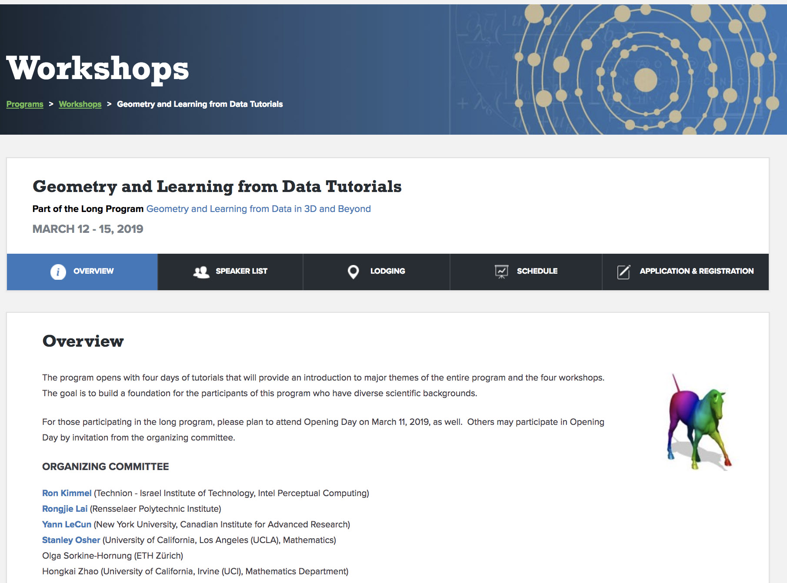

# IPAM Tutorial on Spectral and Graph ConvNets
Notebooks for IPAM Tutorial, March 15 2019<br>
<br>
https://www.ipam.ucla.edu/programs/workshops/geometry-and-learning-from-data-tutorials
<br>
<br>
<br>





### Xavier Bresson
 http://www.ntu.edu.sg/home/xbresson<br>
 https://github.com/xbresson<br>
 https://twitter.com/xbresson <br>
 https://www.facebook.com/xavier.bresson.1 <br>
<br>


<br>
<br>
<br>
<br>

### Installation
   ```sh
   # Conda installation
   curl -o ~/miniconda.sh -O https://repo.continuum.io/miniconda/Miniconda3-latest-Linux-x86_64.sh # Linux
   curl -o ~/miniconda.sh -O https://repo.continuum.io/miniconda/Miniconda3-latest-MacOSX-x86_64.sh # OSX
   chmod +x ~/miniconda.sh
   ./miniconda.sh
   source ~/.bashrc
   #install https://repo.anaconda.com/miniconda/Miniconda3-latest-Windows-x86_64.exe # Windows

   # Clone GitHub repo
   git clone https://github.com/xbresson/IPAM_Tutorial_2019.git
   cd IPAM_Tutorial_2019

   # Install python libraries
   conda env create -f environment.yml
   source activate ipam2019

   # Run the notebooks
   jupyter notebook
   ```
<br>
